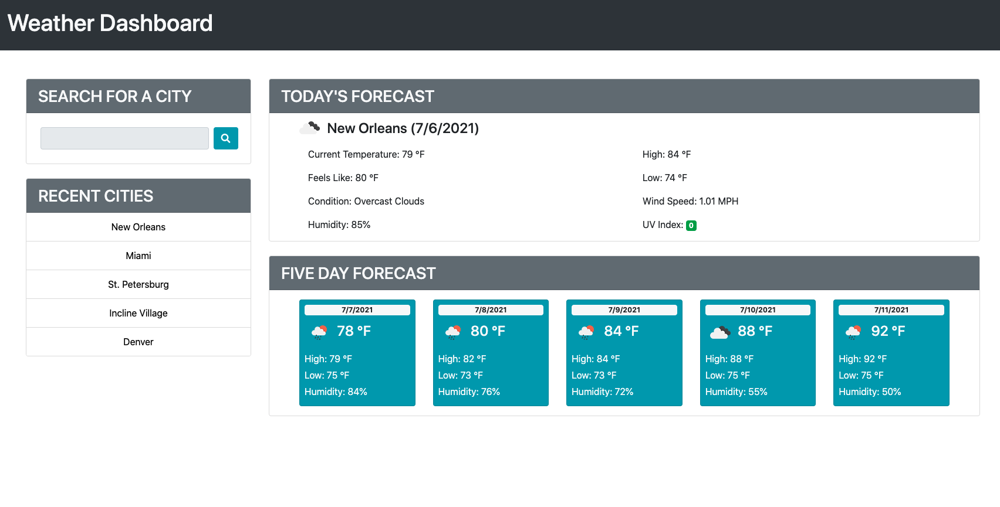

# weather-dashboard

This site is a weather dashboard that displays the current weather conditions including a color coded UV index, 5 day forecast, and saves recent searches in local storage.

## Built With

* [HTML](https://developer.mozilla.org/en-US/docs/Web/HTML)
* [CSS](https://developer.mozilla.org/en-US/docs/Web/CSS)
* [JavaScript](https://developer.mozilla.org/en-US/docs/Web/JavaScript)
* [BootStrap](https://stackpath.bootstrapcdn.com/bootstrap/4.3.1/css/bootstrap.min.css)
* [JQuery](https://code.jquery.com/jquery-3.3.1.slim.min.js)
* [FontAwesome](https://use.fontawesome.com/releases/v5.8.1/css/all.css)
* [MomentJS] (https://cdnjs.cloudflare.com/ajax/libs/moment.js/2.24.0/moment.min.js)

## Deployed Link

* [See Live Site](https://trevcoons.github.io/weather-dashboard/)

## Authors

* **Trevor Coons** 

- [Link to Portfolio Site](https://trevcoons.github.io/trevors-portfolio/)
- [Link to Github](https://github.com/trevcoons)
- [Link to LinkedIn](www.linkedin.com/in/trevor-coons-2a948a104)

## Acknowledgments

Thanks to UC Berkeley Coding Bootcamp for teaching me HTML, JavaScript, JQuery, and BootStrap.